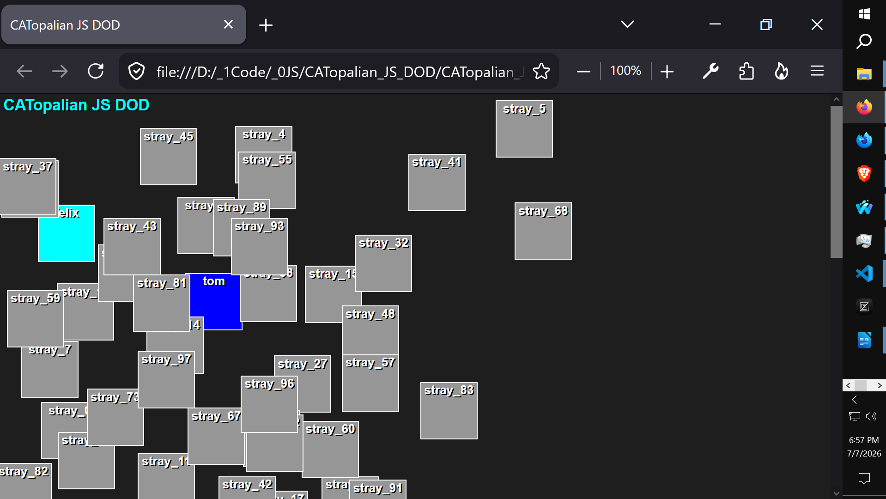

# CATopalian JS DOD
This JavaScript app is a hybrid DOD (data oriented design) approach utilizing OOO for highly efficient simulations and game world designs.

---

Use App: https://christopherandrewtopalian.github.io/CATopalian_JS_DOD/CATopalian_JS_DOD.html

---

Video: https://www.youtube.com/watch?v=fwvLv32ZgQs

---

How to Download this App
1. Click the green Code Button on this github page
2. Choose Download ZIP
3. Save the Zip File
4. Extract All
5. Double click the html file to start the app

---

//----//

// Dedicated to God the Father  
// All Rights Reserved Christopher Andrew Topalian Copyright 2000-2026  
// https://github.com/ChristopherTopalian  
// https://github.com/ChristopherAndrewTopalian  
// https://sites.google.com/view/CollegeOfScripting

